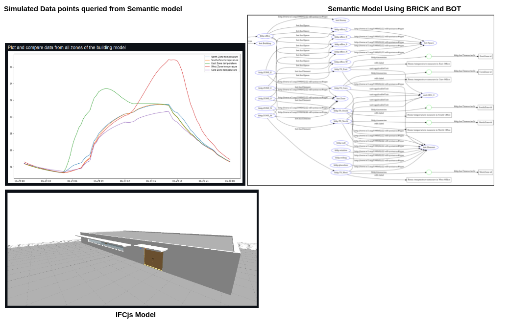
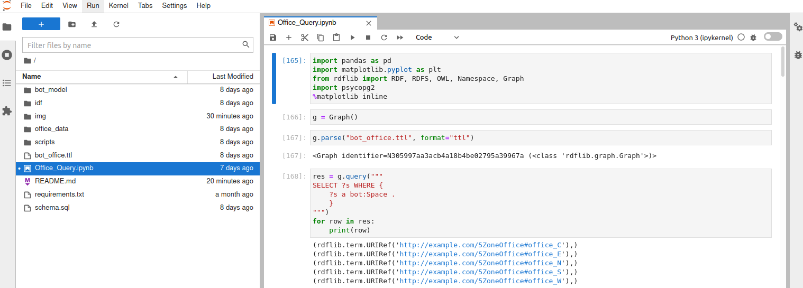
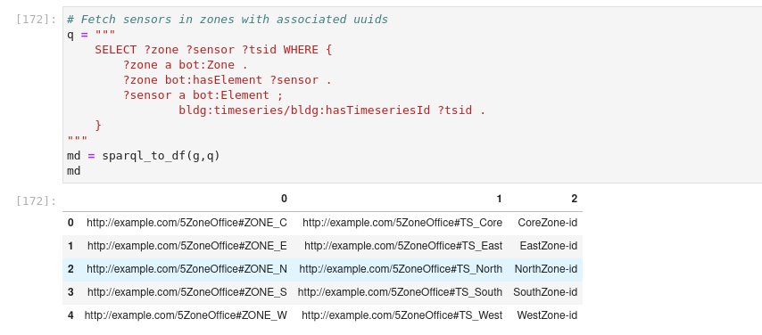
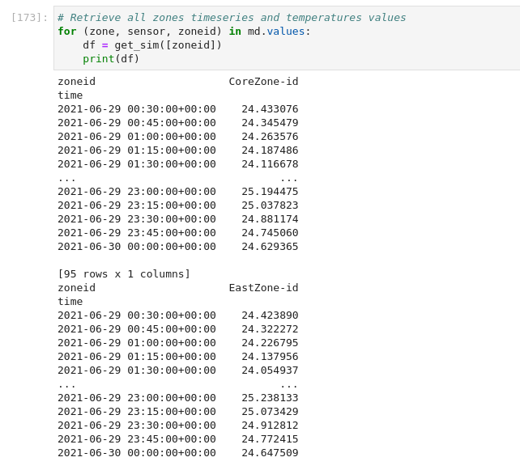
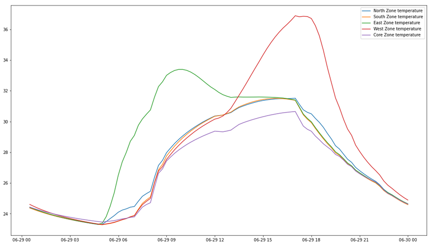

# E+ timeseries to timescaleDB



Time series in [EnergyPlus](https://energyplus.net/) facilitate exchange and representation of energy simulations data points. However, in AECO industry, file-based approaches hinder the integration of these outputs within different actors. Semantic Web Technology (SWT) is gainining traction for improving data interoperability thru linked-data models (RDF, OWL, SPARQL, SKOS). Building Performance Simulation (BPS) community could take advantage of SWT for more efficient approaches to exchange BPS data among different AECO parties.

This repo is based on [brick's data retrieval demo](https://github.com/gtfierro/brick-data-retrieval-demo) by [gtfierro](https://github.com/gtfierro);
which uses BMS data, [brickschema](https://brickschema.org/) and jupyter/timescaledb docker images.

In this demonstration:

* An [EnergyPlus](https://energyplus.net/) model of an single storey
office with 5 HVAC zones is simulated to report every zone temperature during the hottest day of the
year. 
* An ``Output:Variable`` object report the timeseries corresponding to the temperatures of every zone in the model.
* Timeseries data allocated in .csv file is then post-process to report time, zone temperature and an id corresponding to the simulated zone.
* Then a semantic representation of the office is created using [bot](https://w3c-lbd-cg.github.io/bot/) schema for describing the office topology 
* Timeseries ids corresponding to .csv files are mapped into the bot model. 
* Time series data is loaded to timescaledb
* Semantic model and its relationships to timeseries data  are retrieved, arrange and plotted. 



More info on the energy model can be found on e+ "./ExampleFiles/BasicFiles/exercise2.idf" and
on the ["Getting Started"](https://energyplus.net/sites/default/files/pdfs_v8.3.0/GettingStarted.pdf) guide.

To set up repo and access to the detailed example, first start docker containers:

```
# start docker containers
./scripts/start_docker_containers.sh
```

Then load energyplus post-processed timeseries data 

```
# load energyplus timeseries data
./scripts/setup.sh
```

Once configured, you should be able to start the example locally and:

Performe queries


Retrieve timeseries data from zones

 
Access and plot timeseries data of each available zone 


Plot and compare data from all zones of the building model



 
